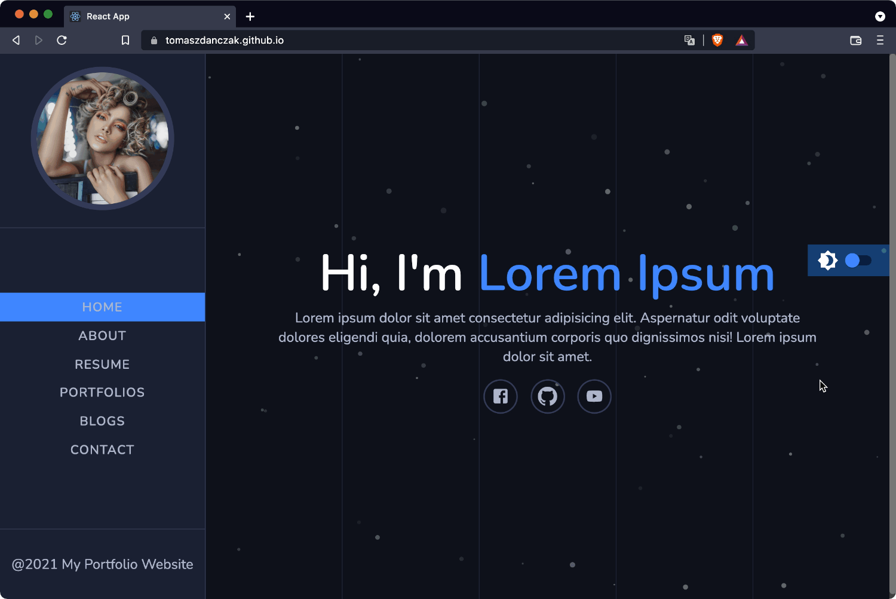

# 🌱 Portfolio by Maclinz

## See [Live 🚀](https://tomaszdanczak.github.io/portfolio-by-maclinz/)   
## About
My work with [React Js and Styled Components Course Tutorial - Build A Full Portfolio Website Project](https://www.youtube.com/watch?v=tiOChpaiFBc) by [MacLinz Universal Channel](https://www.youtube.com/channel/UCn5s7JYuccuKDXN5Mo2XK5Q)

## Things I learned
- 🌱 [Material UI (icons)](https://mui.com/components/material-icons/)
- 🌱 Styled Components
- 🌱 Hooks (useState, useEffect)
- 🌱 [Particle JS](https://vincentgarreau.com/particles.js/)

## Things I practiced
- Functional components
- CSS styles
- Routing
## Things I did myself
- I created components `<DarkModeSwitch/>`, `<Hamburger/>`, `<Lines/>` and logic of them
- I deleted some unnecessary styles
- I published project using gh-pages

## Also I built Git History

